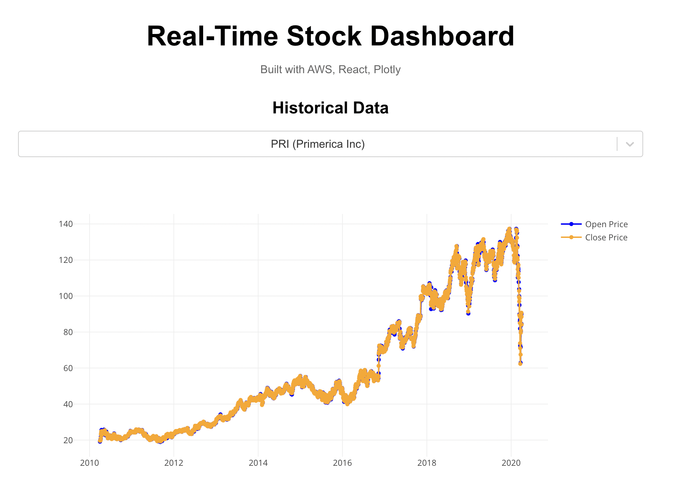
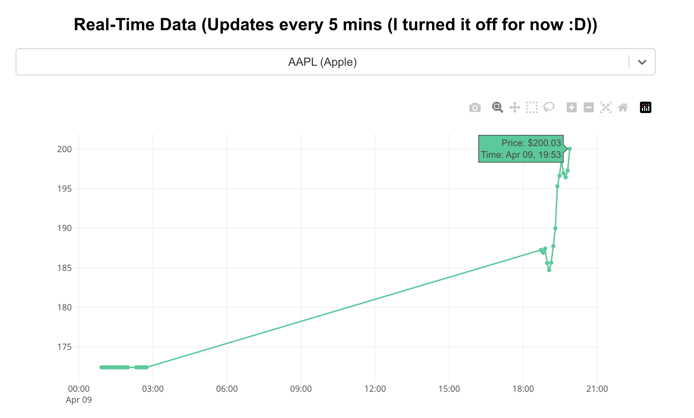

# Serverless Stock Data Pipeline with Real-Time Dashboard

## Overview

The goal of this project is to build a fully serverless, cloud-native analytics system for streaming stock data — built with AWS, React, and Plotly.  

A real-time stock analytics system using serverless architecture and an interactive frontend dashboard.

## Dashboard link: https://serverless-stock-data-pipeline-with-real-time-dashboard.vercel.app/

## Architecture Summary

> Ingestion → Processing → Storage → API → Visualization

All infrastructure is defined using **Terraform**. This ensures that the entire stack is reproducible and scalable.

**Ingestion → Processing → Storage → Visualization**

- **Ingestion:**  
  Data is streamed to **Amazon Kinesis**.

- **Processing:**  
  A **Lambda** function parses each record and stores it in **DynamoDB**.

- **Storage:**  
  **DynamoDB** holds the data indexed by symbol and date.

- **API:**  
  **Amazon API Gateway** exposes a RESTful endpoint for querying symbol-specific data.

- **Visualization:**  
  A **React** dashboard (hosted on Vercel) displays real-time charts using **Plotly.js** and `axios`.
  Fetches live data via the API and renders real-time line charts per company.

## Tools & Technologies

- **AWS Lambda** – Real-time processing & Cloud compute
- **Amazon Kinesis** – Streaming ingestion
- **Amazon DynamoDB** – data store
- **Amazon API Gateway** – Serve data to frontend (API layer)
- **React + Plotly.js** – Interactive dashboard
- **Terraform** – Infrastructure as Code (DevOps / IaC)
- **Python / Node.js** – Lambda + data generation

## Dashboard Features

- **Historical Data**:  
  View open/close stock prices for 20+ companies over time

- **Real-Time Data**:  
  Real-time updates every 5 minutes for selected high-volume stocks (e.g. AAPL, TSLA, AMZN)

- **Fast Queries**:  
  Data is retrieved directly from DynamoDB using symbol as partition key and timestamp as sort key.

# Dashboard Preview 

## Known Issues
- React is Re-rendering the Plot Component, causing problems with the built-in plotly tools 

## Future Improvements (Pending...)

- **Candlestick Charts:**  
  Upgrade to interactive OHLC candlestick visualizations.

- **Monitoring & Alerts**:  
  Add CloudWatch alarms, SNS alerts, and DLQ to productionize the system

- **Time Range Filtering**:  
  Add range-based queries

