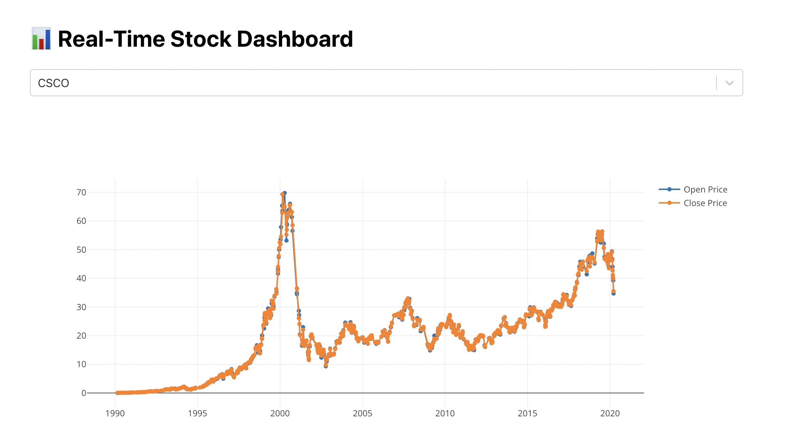

# Serverless Stock Data Pipeline with Real-Time Dashboard

## Overview

The goal of this project is to build a fully serverless, cloud-native analytics system for streaming stock data — built with AWS, React, and Plotly.  

This project simulates a real-time stock analytics system using modern serverless architecture and an interactive frontend dashboard.

## Architecture Summary

Using a custom data generator, I stream historical stock data through **AWS Kinesis**, process it with **AWS Lambda**, store it in **DynamoDB**, and expose it using **API Gateway** to a **React + Plotly** dashboard.

All infrastructure is defined using **Terraform**. This ensures that the entire stack is reproducible and scalable.

**Ingestion → Processing → Storage → Visualization**

- **Ingestion:**  
  Simulated data is streamed to **Amazon Kinesis**.

- **Processing:**  
  A **Lambda** function parses each record and stores it in **DynamoDB**.

- **Storage:**  
  **DynamoDB** holds the data indexed by symbol and date for low-latency queries.

- **API:**  
  **Amazon API Gateway** exposes a RESTful endpoint for querying symbol-specific data.

- **Visualization:**  
  A **React** dashboard displays real-time charts using **Plotly.js** and `axios`.

## Tools & Technologies

- **AWS Lambda** – Real-time processing & Cloud compute
- **Amazon Kinesis** – Streaming ingestion
- **Amazon DynamoDB** – data store
- **Amazon API Gateway** – Serve data to frontend (API layer)
- **React + Plotly.js** – Interactive dashboard
- **Terraform** – Infrastructure as Code (DevOps / IaC)
- **Python / Node.js** – Lambda + data generation

# Dashboard Demo (Basic version)

## Future Improvements (Pending...)

- **Candlestick Charts:**  
  Upgrade to interactive OHLC candlestick visualizations.

